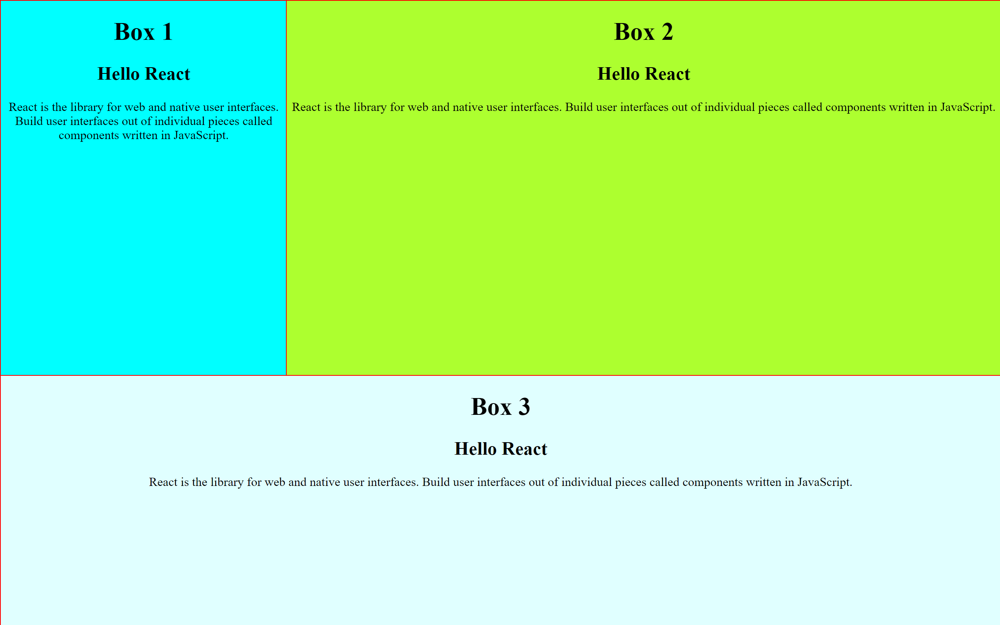
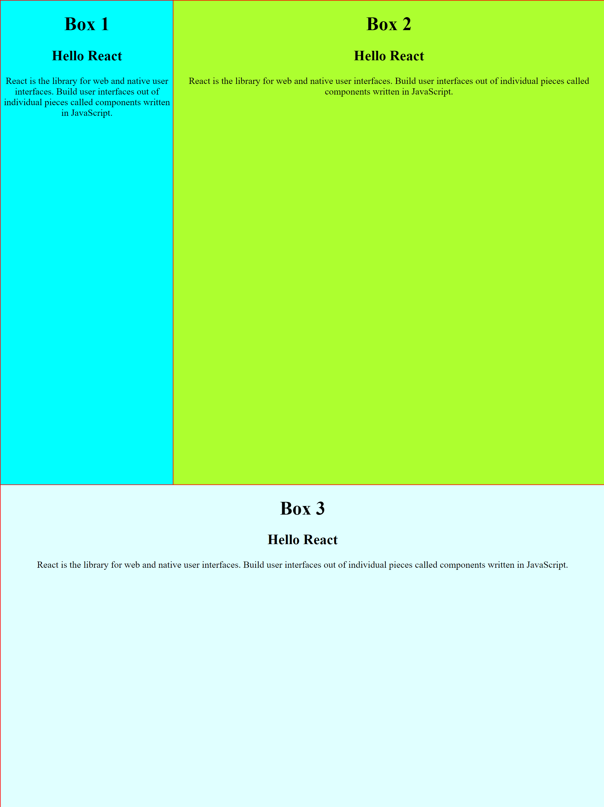
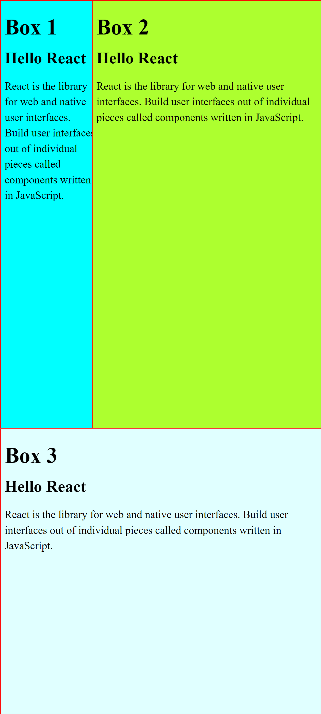

# Resizable Panels Layout with React

This project demonstrates how to create a layout with resizable panels using React and the `react-resizable-panels` package. The layout consists of three different components arranged in a grid-like structure. Users can resize the components by dragging them from any side, and the neighboring components will expand or shrink accordingly.

## Installation

1. Clone the repository:

    ```bash
    git clone https://github.com/Preetiraj3697/Resizable-Panels.git
    ```

2. Navigate into the project directory:

    ```bash
    cd Resizable-Panels
    ```

3. Install dependencies using npm:

    ```bash
    npm install
    ```

4. Start the development server:

    ```bash
    npm start
    ```

5. Open your browser and visit `http://localhost:3000` to see the application running.

## Usage

- The layout consists of three resizable panels: the first row contains two panels, and the second row contains one panel.
- You can resize the panels by clicking and dragging the edges or corners of the panels.
- The neighboring panels will adjust their size accordingly to accommodate the resizing.

## Screenshot

### Laptop Screen


### Tablet Screen


### Mobile Screen


## Dependencies

- [React](https://reactjs.org/): A JavaScript library for building user interfaces.
- [react-resizable-panels](https://www.npmjs.com/package/react-resizable-panels): A React component for resizable panels.

## Contributing

Contributions are welcome! If you find any issues or have suggestions for improvements, please open an issue or create a pull request.


Feel free to customize the README with additional information specific to your project!
